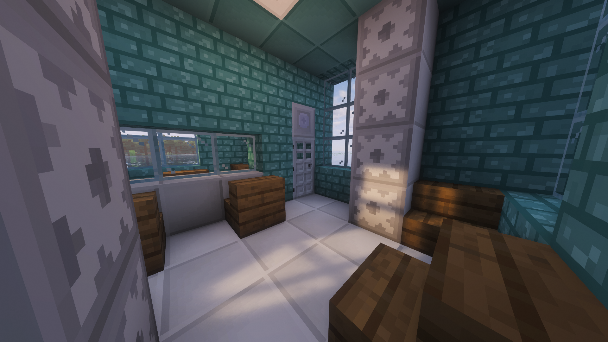
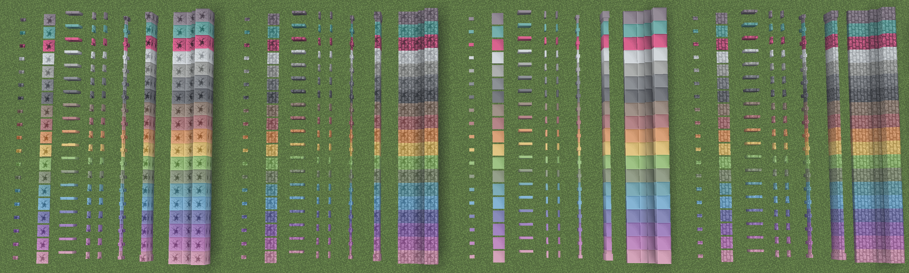
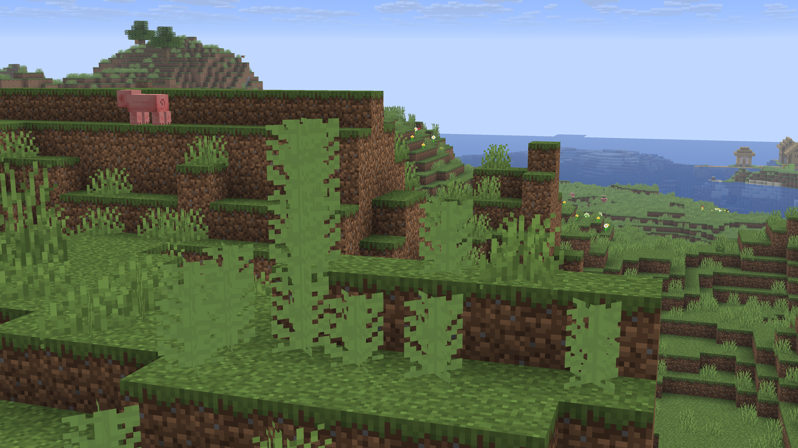
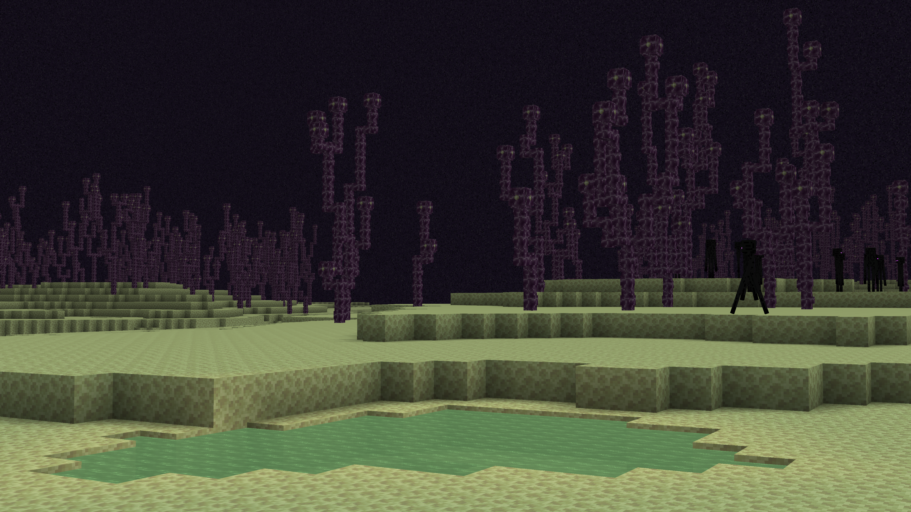
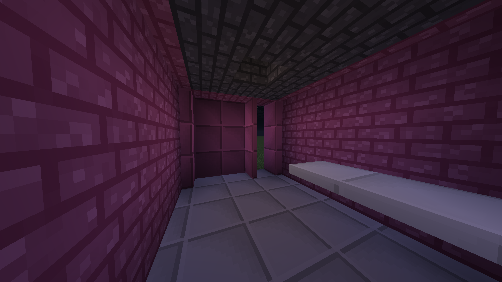
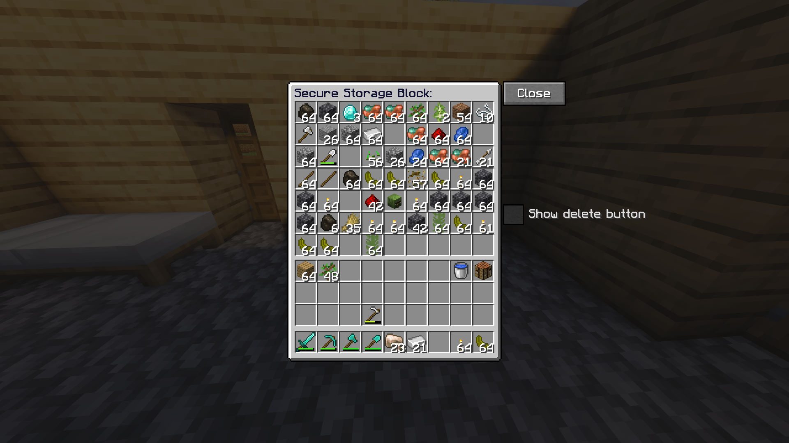
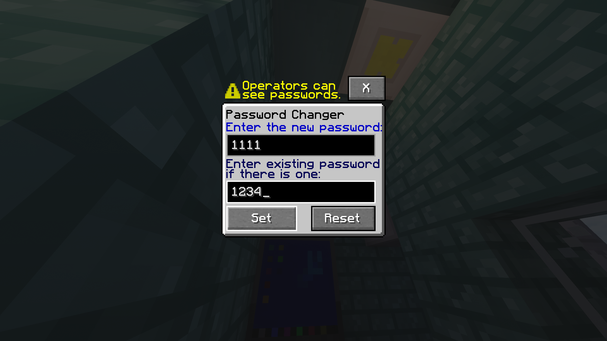
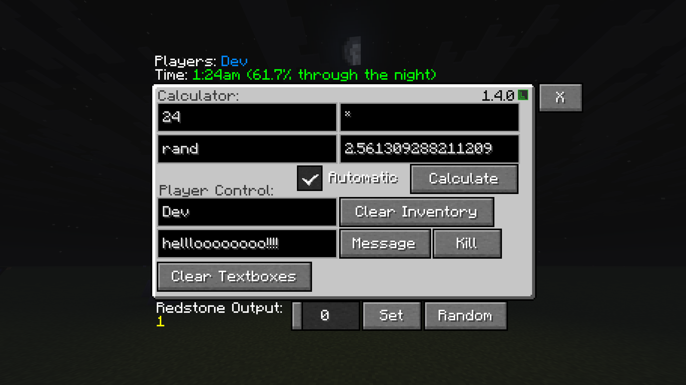

# LlamaBlocks

LlamaBlocks is a mod I've been working on, on and off, since the summer of 2022 using [MCreator](https://mcreator.net). It has a massive variety of interesting features that range from massive sets of building blocks with specific color variants, to the Computer block with a bunch of varied features, or specialized blocks like the Variable Light Block.

## Features:

Each sub-category of this section represents a feature or set of related features.

### Building Blocks

There are Custom Bricks and "Large Tiles" added in LlamaBlocks. Bothcome in 19 colors: All 16 vanilla colors *(White, Light Gray, Gray, Black, Brown, Red, Orange, Yellow, Lime, Green, Cyan, Light Blue, Blue, Purple, Magenta, Pink)*, Industrial (Netherite Colored) variants, Cherry (Hot Pink) variants, and Teal variants

There are also the Tiles *(Black and White)* and the Ceiling tiles *(Blue and Light Gray)*.

Each color variant, or tile type, has a corresponding block set, which includes the following full block, stair, slab, wall, fence, fence gate, trapdoor, pressure plate, and button.

### Banana-Adjacent Features

#### The Banana

The banana is a somewhat bad food item in terms of nutrition, but you can eat them **very fast**. Banana Plants naturally generate in Banana Patches

#### The Golden Banana

When you surround a Banana in 8 gold in a crafting table, you get a Golden Banana. These have more saturation/hunger healing, they give you regeneration for a split second (just enougth for you to heal up once), and you get the Luck effect for 45 seconds after eating them.

#### The Banana Plant

This is a naturally spawning plant which works similarly to something like sugar cane, but it grows 5 blocks high, can be bonemealed, and drops a combination of Bananas/Banana Plants/Bonemeal.

#### Farm Scraps

Farm scraps are non-plantable items which can be used to duplicate some seeds, be composted, and be crafting into brown dye.

### Acid

Acid is a fluid which naturally generates in Acid Lakes in the Outer End Islands, and can be accessed in the Creative menu. When you step into acid, it damages you instantly, kinda like lava. However, it's not based on fire and has a custom damage system.

### The Backpacks

The Backpacks are items which store items like a chest, but are kept in your inventory instead of being placed as a block.

#### The Backpack

This is the cheaper to craft, but less functional, variant of the backpack. It can store 3 rows of items, but that's pretty much it.

#### The Netherite Backpack

The Netherite backpack is an upgrade to the backpack which:
- Has 4 rows of items
- Cannot burn, which protects your items if you drop them or die in fire or lava.
- Has a Delete Items button

### The Variable Light

This is a block which, when a block next to it is updated, will set the light level it produces to the maximum redstone power going into the block.

### The Secure Storage Block

This is like a barrel, but:
- It has 7 rows of items
- There is a button which deletes all items, though there's a checkbox on whether or not to show that button in order to prevent accidental deletions
- It supports having passwords with the Password System

### The Password System

The Secure Storage Block, Computer, and Authenticator all support passwords. By default, the password is blank. When there is no password yet, the Computer and Secure Storage Block skip the password screen, but the Authenticator instead requires the user to leave the password field blank. The user can change passwords using the Password Changer, though they need to enter the existing password. 

#### Important Security Concerns

1. **Operators can see any password**, meaning that all passwords aren't actually private.
2. **Passwords are basically stored in plaintext**, this means that from a cybersecurity perspective, it is very unsafe to put a real password into LlamaBlocks.
> More specifically, passwords are stored in a NBT text tag named `access_password`, which can be easily viewed using the vanilla `/data` command.

### The Authenticator

This asks for a password using the Password System, and, if successful, gives a redstone pulse for 0.75 seconds.

### The Computer

The computer offers a variety of features for information, math, player management, and more. This includes a calculator, random number generator, a player messaging system, a message storage system, a redstone output slider, text with a formatted in-game time, and a list of players.

### Where to Download

You can click any of the platform links below to see LlamaBlocks's page on that website:

[![Modrinth](https://img.shields.io/badge/Modrinth-30B27B?logo=data:image/svg+xml;base64,PD94bWwgdmVyc2lvbj0iMS4wIj8+CjxzdmcgeG1sbnM9Imh0dHA6Ly93d3cudzMub3JnLzIwMDAvc3ZnIiB3aWR0aD0iNTEyIiBoZWlnaHQ9IjUxNCIgdmlld0JveD0iMCAwIDUxMiA1MTQiIGZpbGw9IiMxMTExMTEiPgogIDxwYXRoIGZpbGwtcnVsZT0iZXZlbm9kZCIgY2xpcC1ydWxlPSJldmVub2RkIiBkPSJNNTAzLjE2IDMyMy41NkM1MTQuNTUgMjgxLjQ3IDUxNS4zMiAyMzUuOTEgNTAzLjIgMTkwLjc2QzQ2Ni41NyA1NC4yMjk5IDMyNi4wNCAtMjYuODAwMSAxODkuMzMgOS43Nzk5MUM4My44MTAxIDM4LjAxOTkgMTEuMzg5OSAxMjguMDcgMC42ODk5NDEgMjMwLjQ3SDQzLjk5QzU0LjI5IDE0Ny4zMyAxMTMuNzQgNzQuNzI5OCAxOTkuNzUgNTEuNzA5OEMzMDYuMDUgMjMuMjU5OCA0MTUuMTMgODAuNjY5OSA0NTMuMTcgMTgxLjM4TDQxMS4wMyAxOTIuNjVDMzkxLjY0IDE0NS44IDM1Mi41NyAxMTEuNDUgMzA2LjMgOTYuODE5OEwyOTguNTYgMTQwLjY2QzMzNS4wOSAxNTQuMTMgMzY0LjcyIDE4NC41IDM3NS41NiAyMjQuOTFDMzkxLjM2IDI4My44IDM2MS45NCAzNDQuMTQgMzA4LjU2IDM2OS4xN0wzMjAuMDkgNDEyLjE2QzM5MC4yNSAzODMuMjEgNDMyLjQgMzEwLjMgNDIyLjQzIDIzNS4xNEw0NjQuNDEgMjIzLjkxQzQ2OC45MSAyNTIuNjIgNDY3LjM1IDI4MS4xNiA0NjAuNTUgMzA4LjA3TDUwMy4xNiAzMjMuNTZaIiBmaWxsPSIjMTExMTExIi8+CiAgPHBhdGggZD0iTTMyMS45OSA1MDQuMjJDMTg1LjI3IDU0MC44IDQ0Ljc1MDEgNDU5Ljc3IDguMTEwMTEgMzIzLjI0QzMuODQwMTEgMzA3LjMxIDEuMTcgMjkxLjMzIDAgMjc1LjQ2SDQzLjI3QzQ0LjM2IDI4Ny4zNyA0Ni40Njk5IDI5OS4zNSA0OS42Nzk5IDMxMS4yOUM1My4wMzk5IDMyMy44IDU3LjQ1IDMzNS43NSA2Mi43OSAzNDcuMDdMMTAxLjM4IDMyMy45MkM5OC4xMjk5IDMxNi40MiA5NS4zOSAzMDguNiA5My4yMSAzMDAuNDdDNjkuMTcgMjEwLjg3IDEyMi40MSAxMTguNzcgMjEyLjEzIDk0Ljc2MDFDMjI5LjEzIDkwLjIxMDEgMjQ2LjIzIDg4LjQ0MDEgMjYyLjkzIDg5LjE1MDFMMjU1LjE5IDEzM0MyNDQuNzMgMTMzLjA1IDIzNC4xMSAxMzQuNDIgMjIzLjUzIDEzNy4yNUMxNTcuMzEgMTU0Ljk4IDExOC4wMSAyMjIuOTUgMTM1Ljc1IDI4OS4wOUMxMzYuODUgMjkzLjE2IDEzOC4xMyAyOTcuMTMgMTM5LjU5IDMwMC45OUwxODguOTQgMjcxLjM4TDE3NC4wNyAyMzEuOTVMMjIwLjY3IDE4NC4wOEwyNzkuNTcgMTcxLjM5TDI5Ni42MiAxOTIuMzhMMjY5LjQ3IDIxOS44OEwyNDUuNzkgMjI3LjMzTDIyOC44NyAyNDQuNzJMMjM3LjE2IDI2Ny43OUMyMzcuMTYgMjY3Ljc5IDI1My45NSAyODUuNjMgMjUzLjk4IDI4NS42NEwyNzcuNyAyNzkuMzNMMjk0LjU4IDI2MC43OUwzMzEuNDQgMjQ5LjEyTDM0Mi40MiAyNzMuODJMMzA0LjM5IDMyMC40NUwyNDAuNjYgMzQwLjYzTDIxMi4wOCAzMDguODFMMTYyLjI2IDMzOC43QzE4Ny44IDM2Ny43OCAyMjYuMiAzODMuOTMgMjY2LjAxIDM4MC41NkwyNzcuNTQgNDIzLjU1QzIxOC4xMyA0MzEuNDEgMTYwLjEgNDA2LjgyIDEyNC4wNSAzNjEuNjRMODUuNjM5OSAzODQuNjhDMTM2LjI1IDQ1MS4xNyAyMjMuODQgNDg0LjExIDMwOS42MSA0NjEuMTZDMzcxLjM1IDQ0NC42NCA0MTkuNCA0MDIuNTYgNDQ1LjQyIDM0OS4zOEw0ODguMDYgMzY0Ljg4QzQ1Ny4xNyA0MzEuMTYgMzk4LjIyIDQ4My44MiAzMjEuOTkgNTA0LjIyWiIgZmlsbD0iIzExMTExMSIvPgo8L3N2Zz4K)](https://modrinth.com/mod/llamablocks)

[![MCreator.net](https://img.shields.io/badge/-Mcreator.net-gray?style=flat&logo=data%3Aimage%2Fpng%3Bbase64%2CiVBORw0KGgoAAAANSUhEUgAAAEAAAABACAYAAACqaXHeAAAABHNCSVQICAgIfAhkiAAAAAlwSFlzAAAFiQAABYkBbWid%2BgAAABl0RVh0U29mdHdhcmUAd3d3Lmlua3NjYXBlLm9yZ5vuPBoAAAa%2BSURBVHic7VtdbBzVFf6%2BO7ubGCcO0JKAG7WCKiAaSAUxsN51raRSeQD6RGupUtWnSlTlT0h9qYrUB5CQUB8qWYgi4I0n8wgkIAERrnestkuLW1xaiCK1zY9CocGJY3vXu%2Ffrw2bpejy7e%2B%2FseGnpftJK3nvPnHPm23PPOXPvGBhggAEGGOD%2FF%2FQRLpVKuwHcaYzZLckCWAEASesklwGcyuVyi2NjY0tpOTgzMxPs3bv3a8aYnKSVWq1WAXBuaGioMjY2ttKrfi8CwjB8H8C%2BLmIXSN4xPj7%2BXnK3GiiVSrtJzgO4roPYxwCeKhQKP09iw7gKzs7OXoPuNw8AO621Y0mciYLk%2Feh88wDwBQCPlsvly5LYcCYgk8nc4azUmDNJnImC5J2OoucPHjy4msSGMwEAbncVtNb%2BMYEvG1Auly%2BTdKuj%2BAJJJbHjQ8BtjnJni8Xih0mcaUW1Wh0HkHORlZSYcB8CbnER6sWZiJ5veIj%2FIakdJwLm5uZG0Ug2XUHy%2FaTOtMIYM%2BkqGwTB1kaAMeaAq0KSV4dheGVShwDgyJEj2yS5Jt3a6urqYlJbGUe5m10VSroXwL1hGP4dwA8KhcJbLteFYXg7gMcAnAewB4BrWfvL4cOH11z9i8KJAJIHJO8k%2B2WStwJwIgDAEwC%2B6WuE5Du%2B17TCNQk6R0ArJDl1g8eOHdsOYCKhjYUk1zXRNQLK5XK2Wq3emEC3crlc2UVwaGjoemvtyQQ2IOm3Sa5rouuzQBiGNwNIkmXPFgqFq%2BMmpn99zyEEuiqBzjZQluCO5jcL0YiXR4RGBLz3YPGVF1oHXXJAovAHcFWpVJosFouzrYPTpbt%2FBuhxJOrb2oEb1DHyvQkBcwD8CEiYAAHAkDxWKpWOA%2FibMeaD19Z%2B%2BjCAnyRRlgZI%2FC465pIEk0YA0CDhepLfkvSje3b%2BIgeg3oO%2BniDhjehYVwIkfT0l%2B6ZarV4B4JOU9HmCH2LJvh4d7UjApY7uS2m5YK0NCNbS0ueJpx%2B662glOtiRAJLOLbALJGVE9X8JCBdr9fVn4qY6EmCtTZWAbDYbQP3PAQSefGTytdhNmm5VoJcEuAnW2gBgDX418BSFl0EsSDgFg22wNDTaBQACRigEAocEbW%2B9kOCaiBM7qssz7ZR3JICkDwGfADgOYC8aDzObmixJGcB9CUh49fKLh76zb2Tie5ImQOwBcCUMApK%2FGh8ff87Dv1i0JUCSmZ%2Bf3%2B%2FurJ4qFouPAsDi4mJuaWnpXwCGW2WstQEC1F0DgAbhvpGJ70p6NsZeKlvvbXPA%2FPz8dQB2tJuPwZvNP%2Fbv318FsC0qkMlkAvrkAPEkgNG4qTT2HYEOBHjWfxsEwacPPuVyOYuY6LLWBgLcyyB12lob9zyxevr06eMe%2FrVFpyrgs%2F7%2Fms%2Fnzze%2FrK2tbY8TkhTQpxO0%2BpjknpiZd6emplKpJm0J8OwBNvTYJIfihIIgCOSxBESdQyOhRvEnD986olME3OShZ8OurKR2EZAB3Qmo0Z4D8MWYqa0lYGFhYRjAVz30bHAom822XQLwyAHDuY8uID4Rby0BKysrN7Wbi0OtVtuQkev1%2Bj8APA%2FgzwBOND9BEFThngPsfWNvr0sajk5ISo2A2D7AWnuAdD44PjM5OfnP1oFCobAK4IdxwtPh3Y849gEVACAZjYAzaZw8NdHuV%2FapAF71WOJFR9HKzMxMACC6nFL79YE2BHhWAM%2BGRMuOgpXR0dG4s4FUGqAm2kXADR463vUy2HiTxAWVXC63af2T9LLX1Z92xh2vXzPGvNld7D%2BQrOsSqK6vr8cRkPggNA6xSdAY831r7cNonAhfcenTzIrrAM5K%2Br2kJwqFgtd%2BvsBlx%2FRaudRPfETyPBpHZkfz%2BXyqSyCWgHw%2BP4fGFvIGSDIkbU8WqWXIiYLKxMTEIoAUzw82w%2Bf9APR88wBgjXMO6NmWA7wISAOELrhJqrq1njTQdwJE43qU%2FfmMANDtxugo1yv6ToCp190iQPx8EkDj9suKsY%2FBqcP1FZnUYBmsQQ7FRDg0XbrrlyCP6tIeAus2C2M67FNuPCZvMXrygYmXj8Rd4fWucBqYfuvb1yJjT%2FTbLoEfP1B85enoeN%2BXQI3VxC809QIB98eN978MZvqT3aMgEHuO0HcC6hf0mRAg8r%2BDgK8s7fpMlgCE2H%2Bu6DsBU1Mv1uFzOJIa4ktP%2FzvBBvpeBQT8Jm68730AAGjJHgh28caaZRCdMxQVNF5xM1bDInOwGKHBJtlPYVGRaYQ4wZqgjKCMAXfCyloTfPDg%2BEuzD23ZHQ0wwAAD%2FI%2Fi33HsUzu5cCH%2BAAAAAElFTkSuQmCC)](https://mcreator.net/modification/121457/llamablocks)

### Licensing, Modpacks, etc

You can use LlamaBlocks with credit, or use its code or even jar files in a Modpack or other project, as long as that use is compliant with the [GPLv3](https://www.gnu.org/licenses/gpl-3.0.en.html) license.
