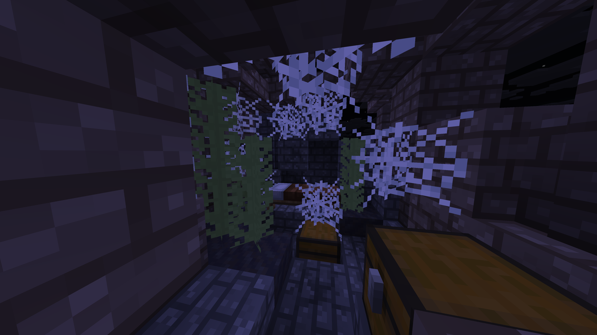

# Abandoned Farm
The abandoned farm is a naturally generated structure designed to provide easy early-game access to vanilla and LlamaBlocks resources.

It generates in these biomes: `Badlands`, `Bamboo Jungle`, `Dark Forest`, `Beach`, `Birch Forest`, `Desert`, `Eroded Badlands`, `Forest`, `Grove`, `Frozen Peaks`, `Jagged Peaks`, `Jungle`, `Savanna`, `Savanna Plateau`, `Windswept Savanna`, `Mangrove Swamp`, `Sparse Jungle`, `Windswept Hills`, `Windswept Forest`, `Wooded Badlands`, `Taiga`, `Swamp`, `Snowy Taiga`, `Snowy Plains`, and `Snowy Beach`.

It includes 2 loot chests which are guaranteed to contain vanilla loot and LlamaBlocks loot through a custom loot table, a bed, cobwebs, some Banana Plants on mud, and more.

### Showcase Image
